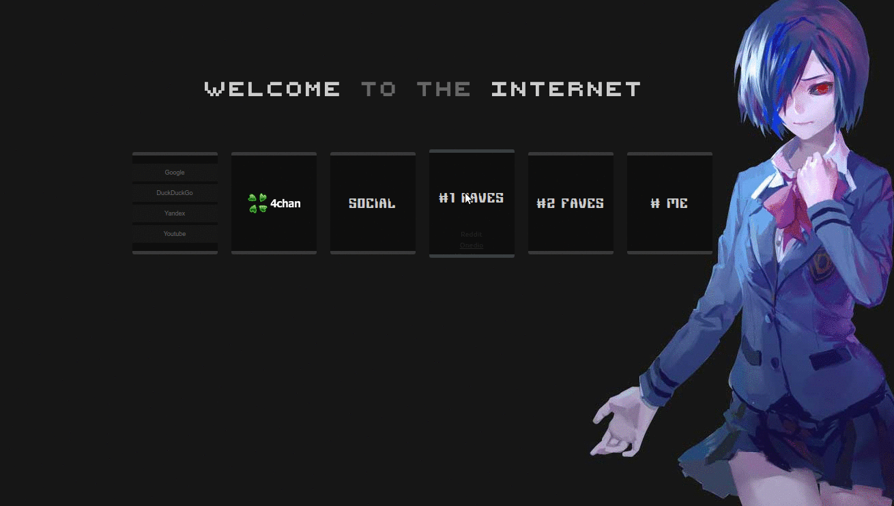

# retro-rain startpage
It's my first startpage. You can use it. All lines are described by comment sections.

## Features:
* Hidden links
* Customize it
* Change all links
* CSS transition effects
* Image or text support for box header
* I just used HTML and CSS. It means, it's fast.

## Screenshots:
----

